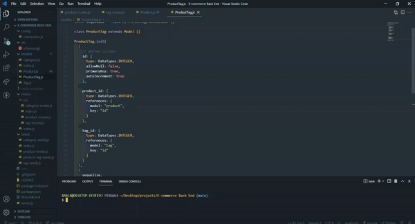
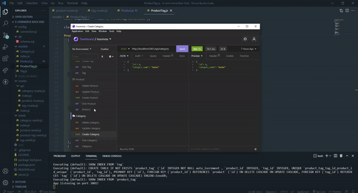
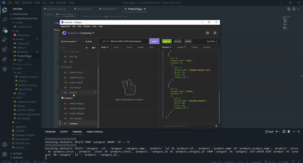
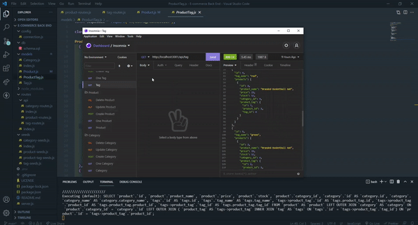

# E-Commerce Back End
  ## Table of Contents:
  * [Description](#description)
  * [Screenshots](#screenshots)
  * [How to install](#installation)
  * [Credits](#credits)
  * [Email](#email)
  * [GitHub](#github)

## Description 
As a manager at an internet retail company, I want a back end for my e-commerce website that uses the latest technologies so that my company can compete with other e-commerce companies

## Screenshots

## How to install 
You can clone the repository by clicking the green code button above and then click the 'Download Zip' option. 
 
## Credits 
Created By: Brent Albers.
Contribution by: [Jeremy Lentz](https://github.com/jlentz17)

## Email
Have any questions? feel free to email me at brent.albers@yahoo.com. 

## GitHub
Follow me on github where you can also ask me questions here at https://github.com/BA1bers.
